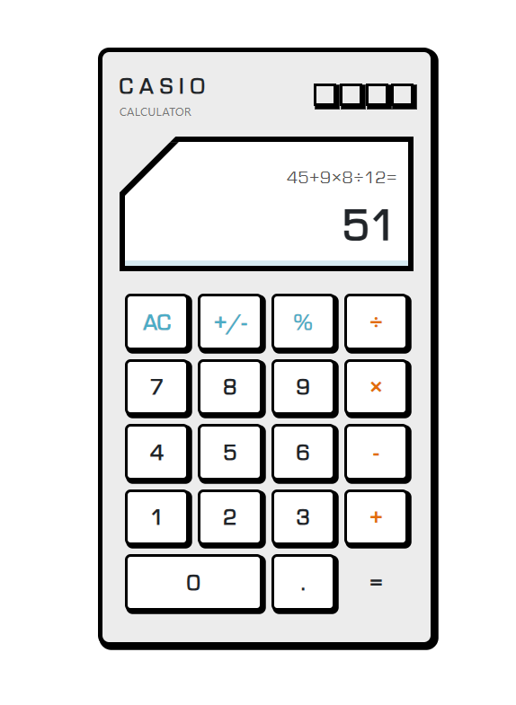

# 🧮 Casio Calculator

Uma calculadora inspirada no design clássico das calculadoras Casio, desenvolvida com HTML, CSS (incluindo Bootstrap) e JavaScript. O projeto recria com fidelidade o visual nostálgico e a funcionalidade básica de uma calculadora física.

## 📸 Preview



## 🚀 Tecnologias Utilizadas

- HTML5
- CSS3 (com uso de Bootstrap 5)
- JavaScript
- jQuery
- Fonte Eurostile (via CDN)

## 🎯 Funcionalidades

- Operações básicas: adição, subtração, multiplicação e divisão
- Cálculo de porcentagens
- Inversão de sinal (+/-)
- Botão de limpar (AC)
- Interface responsiva e fiel ao estilo Casio

## 📂 Estrutura do Projeto

```
/
├── index.html
├── styles.css
├── scripts.js
└── README.md
```

## 💻 Como Usar

1. Clone o repositório:
   ```bash
   git clone https://github.com/santosalexandregomes/calculadora.git
   ```

2. Abra o `index.html` no seu navegador.

## ✅ Próximos Passos (Ideias)

- Adição de memória (M+, M-, MR, MC)
- Modo científico
- Teclado virtual interativo

## 📄 Licença

Este projeto está licenciado sob a licença MIT.

---
